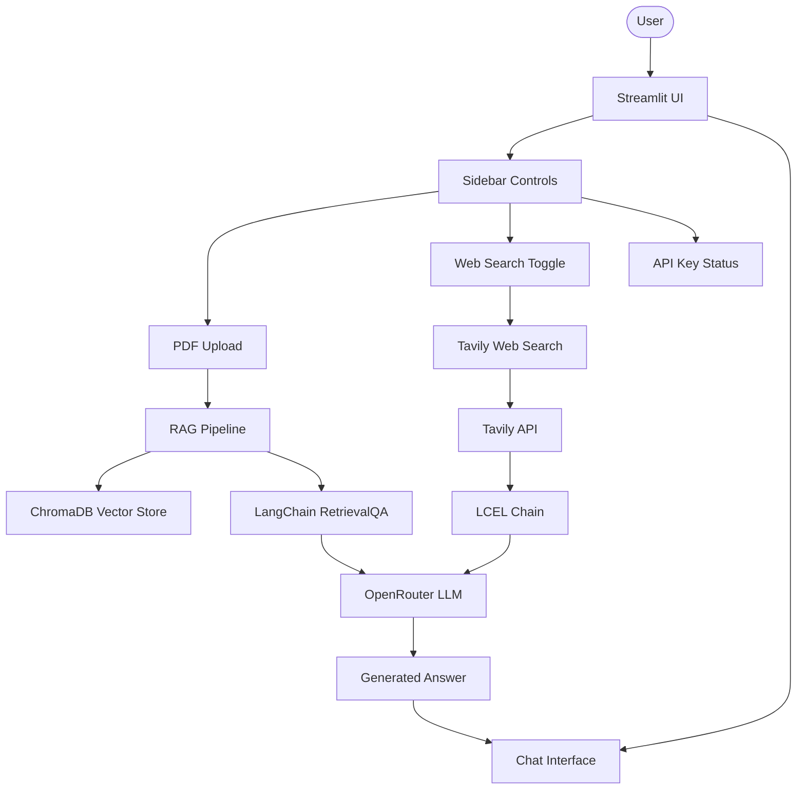
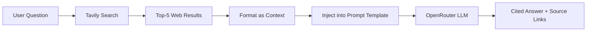
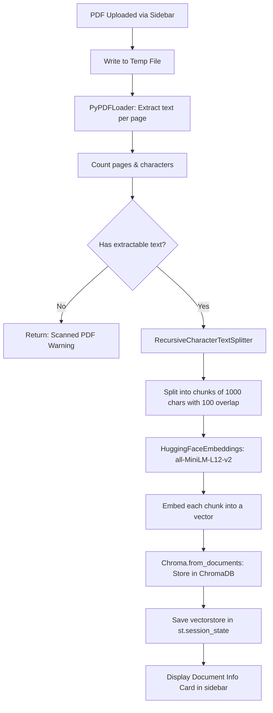
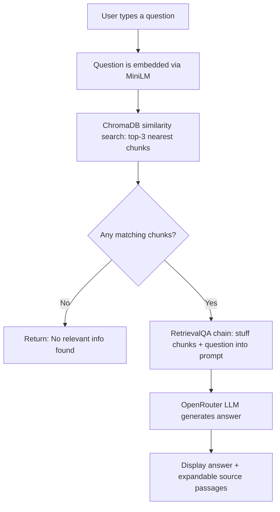

# RAG Chatbot

A Streamlit-based Chatbot application using **Retrieval-Augmented Generation (RAG)** to query PDF documents and perform live web searches. It leverages LangChain for orchestration, HuggingFace for embeddings, and OpenRouter + Tavily APIs for LLM inference and search results.

---

## Table of Contents

- [Features](#features)
- [Project Structure](#project-structure)
- [Architecture & Flow](#architecture--flow)
- [How RAG Works (Auto PDF Pipeline)](#how-rag-works-auto-pdf-pipeline)
- [The Role of LangChain](#the-role-of-langchain)
- [Setup & Installation](#setup--installation)
- [Environment Variables](#environment-variables)
- [Dependencies](#dependencies)
- [Usage](#usage)
- [License](#license)

---

## Features

- **PDF Document QA** — Upload any PDF and ask natural-language questions about its content
- **Live Web Search** — Answers augmented with real-time web results via Tavily
- **Auto-Indexing** — PDF is automatically chunked, embedded, and stored in ChromaDB on upload
- **Document Diagnostics** — Sidebar displays page count, character count, chunk count, and embedding model info
- **Source Citations** — Expandable source passages for PDF answers and clickable web source links
- **Wide Layout UI** — Clean, modern Streamlit interface with custom gradient header
- **Dual-Mode** — Switch between PDF and Web modes from the sidebar at any time

---

## Project Structure

```
Chatbot-with-RAG-main/
├── app.py                 # Main unified deployment application (Streamlit + RAG + Web Search)
├── phase_1.py             # Tutorial phase 1: Basic Streamlit chatbot UI
├── phase_2.py             # Tutorial phase 2: LLM integration via Groq
├── phase_3.py             # Tutorial phase 3: RAG with PDF ingestion
├── requirements.txt       # Python dependencies for pip
├── Pipfile                # Pipenv dependency specification
├── Pipfile.lock           # Locked Pipenv dependencies
├── .env.example           # Template for environment variables (create manually)
├── .gitignore             # Git ignore rules (create manually)
└── README.md              # This file
```

### File Descriptions

| File | Role |
|---|---|
| `app.py` | **Production entry point.** Unified app with PDF RAG + Tavily web search, custom CSS, session state management, and document diagnostics. Run with `streamlit run app.py`. |
| `phase_1.py` | Minimal chatbot UI — no LLM, just echoes back user input. Teaches Streamlit session state and `st.chat_message`. |
| `phase_2.py` | Adds LLM inference via Groq API. Demonstrates `ChatPromptTemplate` → `ChatGroq` → `StrOutputParser` chain. |
| `phase_3.py` | Adds RAG pipeline with `VectorstoreIndexCreator`, `PyPDFLoader`, `RecursiveCharacterTextSplitter`, and `RetrievalQA`. |

---

## Architecture & Flow

### High-Level System Architecture



### RAG Request-Response Flow


### Web Search Flow



---

## How RAG Works (Auto PDF Pipeline)

When a user uploads a PDF in the sidebar, the following pipeline runs **automatically**:



### Step-by-Step Breakdown

1. **Upload** — The user selects a PDF file via `st.file_uploader` in the sidebar.
2. **Hash Check** — An MD5 hash of the file is computed. If it matches the previously processed PDF, the app skips re-processing (avoiding duplicate work).
3. **Temp File** — The PDF bytes are written to a temporary file (required by `PyPDFLoader`).
4. **Text Extraction** — `PyPDFLoader` reads each page and extracts its text content. If the total character count is 0, the PDF is flagged as scanned (OCR needed).
5. **Chunking** — `RecursiveCharacterTextSplitter` splits the document into overlapping chunks of 1,000 characters with 100 characters of overlap. This preserves context across chunk boundaries.
6. **Embedding** — Each chunk is converted to a 384-dimensional vector using the `all-MiniLM-L12-v2` sentence-transformer model (runs locally, no API call).
7. **Vector Storage** — Chunks and their embeddings are stored in an in-memory ChromaDB instance.
8. **Session State** — The vectorstore object is saved in `st.session_state.vectorstore`, making it available across all subsequent user questions.
9. **Ready** — The sidebar displays a document info card (filename, pages, characters, chunks, embedding model).

### When the User Asks a Question



The key insight: **the vectorstore persists in session state**, so every new question just does a similarity search against the same index — no re-embedding or re-processing needed.

---

## The Role of LangChain

LangChain is the **orchestration backbone** of this project. Here is how each LangChain module is used:

| Module | Import | Role |
|---|---|---|
| **ChatOpenAI** | `langchain_openai` | LLM client pointed at OpenRouter's OpenAI-compatible API. Handles all inference calls. |
| **ChatPromptTemplate** | `langchain_core.prompts` | Defines prompt templates with variables (`{context}`, `{question}`, `{user_prompt}`). |
| **StrOutputParser** | `langchain_core.output_parsers` | Extracts the raw string answer from the LLM response object. |
| **PyPDFLoader** | `langchain_community.document_loaders` | Loads PDF files and converts them into LangChain `Document` objects with metadata. |
| **RecursiveCharacterTextSplitter** | `langchain_text_splitters` | Splits documents into overlapping chunks, respecting paragraph and sentence boundaries. |
| **Chroma (vectorstore)** | `langchain_community.vectorstores` | In-memory vector database. Stores chunk embeddings and performs similarity search at query time. |
| **RetrievalQA** | `langchain_classic.chains` | High-level chain that combines retriever + LLM. Fetches relevant chunks, stuffs them into the prompt, and generates an answer. |
| **VectorstoreIndexCreator** | `langchain_classic.indexes` | Convenience wrapper that builds a vectorstore index from document loaders in one call (used in `phase_3.py`). |

### LCEL (LangChain Expression Language) Pipeline

The web search mode uses LCEL's pipe syntax to compose a chain:

```python
chain = web_prompt | get_llm() | StrOutputParser()
#         ↑            ↑              ↑
#   Format prompt   Call OpenRouter   Extract string
```

---

## Setup & Installation

### Prerequisites

- **Python 3.11+** (3.12 or 3.13 recommended)
- **pip** or **pipenv**

### Step 1: Clone and Navigate

```bash
git clone <your-repo-url>
cd Chatbot-with-RAG-main
```

### Step 2: Install Dependencies

```bash
# Option A: pip
pip install -r requirements.txt

# Option B: pipenv
pipenv install
pipenv shell
```

### Step 3: Configure Environment Variables

Create a `.env` file in the project root:

```env
OPENROUTER_API_KEY=your-openrouter-api-key
OPENROUTER_BASE_URL=https://openrouter.ai/api/v1
OPENROUTER_MODEL=deepseek/deepseek-v4-flash
TAVILY_API_KEY=your-tavily-api-key
```

### Step 4: Run the App

```bash
streamlit run app.py
```

The app opens at `http://localhost:8501`.

---

## Environment Variables

| Variable | Required | Default | Description |
|---|---|---|---|
| `OPENROUTER_API_KEY` | Yes | — | API key from [openrouter.ai](https://openrouter.ai) |
| `OPENROUTER_BASE_URL` | No | `https://openrouter.ai/api/v1` | OpenRouter API endpoint |
| `OPENROUTER_MODEL` | No | `deepseek/deepseek-v4-flash` | Model identifier for OpenRouter |
| `TAVILY_API_KEY` | Yes | — | API key from [tavily.com](https://tavily.com) |

---

## Dependencies

Full list from `requirements.txt`:

```
streamlit>=1.32              # Web UI framework
langchain>=0.2               # Core LangChain framework
langchain-core>=0.2          # LangChain core abstractions (prompts, parsers, chains)
langchain-community>=0.2     # Community integrations (PyPDFLoader, Chroma vectorstore)
langchain-openai>=0.1        # OpenAI-compatible LLM client (ChatOpenAI)
langchain-huggingface>=0.0.3 # HuggingFace embedding models integration
chromadb>=0.5                # Vector database for storing and searching embeddings
sentence-transformers>=2.6   # Local embedding models (all-MiniLM-L12-v2)
pypdf>=4.0                   # PDF text extraction
cryptography>=3.1            # AES decryption support for encrypted PDFs
tavily-python>=0.5           # Tavily web search API client
python-dotenv>=1.0           # Load environment variables from .env files
```

---

## Usage

### PDF Document QA Mode

1. Select **PDF Document** in the sidebar
2. Upload a PDF file
3. Wait for the document info card to appear (confirms indexing is complete)
4. Type a question in the chat input
5. View the answer and expand the source passages to see which chunks were used

### Web Search Mode

1. Select **Web Search (Tavily)** in the sidebar
2. Type a question
3. View the answer with cited web sources
4. Expand the web sources panel to see links and snippets

---

## License

This project is licensed under the **MIT License** — see below for details.

```
MIT License

Copyright (c) 2025

Permission is hereby granted, free of charge, to any person obtaining a copy
of this software and associated documentation files (the "Software"), to deal
in the Software without restriction, including without limitation the rights
to use, copy, modify, merge, publish, distribute, sublicense, and/or sell
copies of the Software, and to permit persons to whom the Software is
furnished to do so, subject to the following conditions:

The above copyright notice and this permission notice shall be included in all
copies or substantial portions of the Software.

THE SOFTWARE IS PROVIDED "AS IS", WITHOUT WARRANTY OF ANY KIND, EXPRESS OR
IMPLIED, INCLUDING BUT NOT LIMITED TO THE WARRANTIES OF MERCHANTABILITY,
FITNESS FOR A PARTICULAR PURPOSE AND NONINFRINGEMENT. IN NO EVENT SHALL THE
AUTHORS OR COPYRIGHT HOLDERS BE LIABLE FOR ANY CLAIM, DAMAGES OR OTHER
LIABILITY, WHETHER IN AN ACTION OF CONTRACT, TORT OR OTHERWISE, ARISING FROM,
OUT OF OR IN CONNECTION WITH THE SOFTWARE OR THE USE OR OTHER DEALINGS IN THE
SOFTWARE.
```

---

## Acknowledgments

- [LangChain](https://github.com/langchain-ai/langchain) — Orchestration framework
- [Streamlit](https://streamlit.io) — UI framework
- [OpenRouter](https://openrouter.ai) — Unified LLM API gateway
- [Tavily](https://tavily.com) — Search API for AI agents
- [ChromaDB](https://www.trychroma.com) — Open-source embedding database
- [Hugging Face](https://huggingface.co) — Sentence-transformer models
# RAG Chatbot

A Streamlit-based Chatbot application using Retrieval-Augmented Generation (RAG) to query PDF documents and perform live web searches. It leverages LangChain for orchestration, HuggingFace for embeddings, and OpenRouter + Tavily APIs for model inferences and search results.
