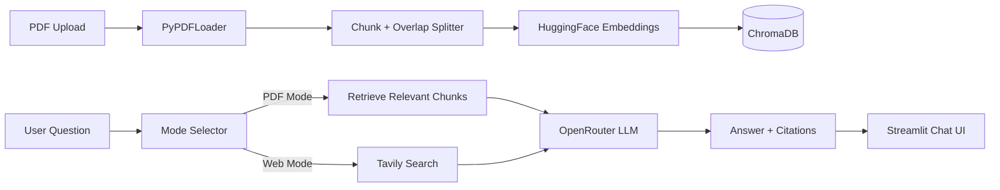
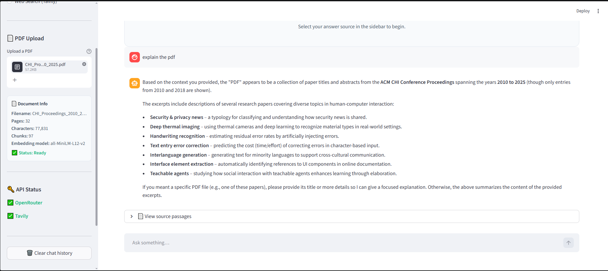
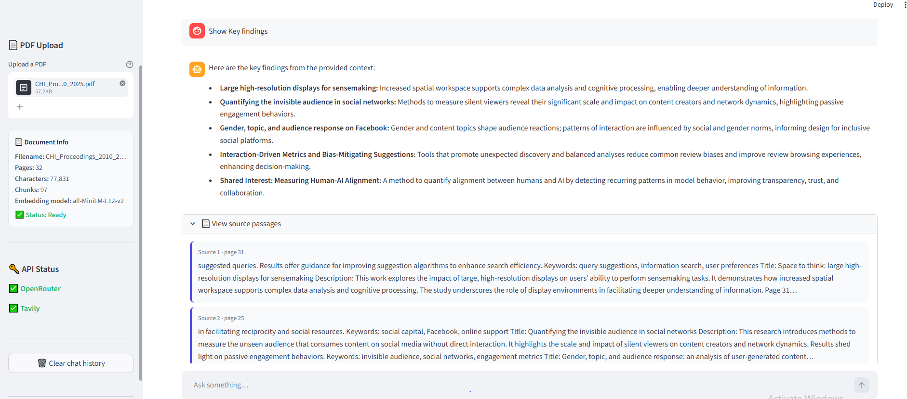
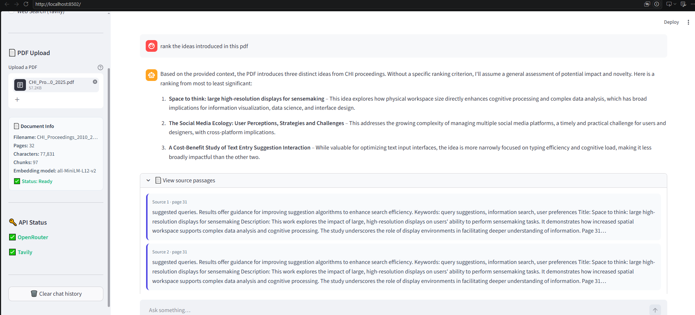

# Context ChatBot

A Streamlit RAG assistant that answers questions from uploaded PDFs and augments answers with live web search when needed. The goal of this repo is to show a practical document-QA workflow with source traceability and a clean deployment path.

**Status:** Functional prototype  
**Stack:** Python, Streamlit, LangChain, ChromaDB, HuggingFace embeddings, OpenRouter, Tavily  
**Focus:** PDF question answering, retrieval pipelines, hybrid local-plus-web answers

## Why this project

Many document chat demos stop at "upload a PDF and ask a question." This project goes one step further by combining local document retrieval with web search so users can compare a document's contents with external sources in the same interface.

## Core capabilities

- Upload a PDF and automatically build a vector index.
- Ask document questions with retrieved source passages.
- Switch to live Tavily web search for current information.
- View page count, chunk count, character count, and embedding details.
- Use one Streamlit app for both document mode and web mode.

## Architecture list

1. Interface layer
   a. Streamlit layout for chat, file upload, and sidebar diagnostics  
   b. Session state for active vectorstore and conversation flow
2. Retrieval layer
   a. `PyPDFLoader` for extraction  
   b. `RecursiveCharacterTextSplitter` for chunking  
   c. `HuggingFaceEmbeddings` + `ChromaDB` for vector search
3. Answer layer
   a. `RetrievalQA` for document-grounded responses  
   b. Tavily search + prompt formatting for web-grounded responses
4. Model layer
   a. OpenRouter-backed LLM responses  
   b. Source citations and answer rendering

## Implementation diagram



## Project structure

```text
Context_ChatBot/
├── app.py           # Unified app entry point
├── phase_1.py       # Basic Streamlit chat prototype
├── phase_2.py       # LLM integration step
├── phase_3.py       # PDF RAG step
├── requirements.txt
├── Pipfile
└── README.md
```

## Demo questions to try

- "Summarize the main findings from this PDF."
- "What limitations are mentioned in section 4?"
- "Compare this document's claims with recent web sources."
- "Which pages support the final conclusion?"

## Local setup

```bash
pip install -r requirements.txt
streamlit run app.py
```

Create a `.env` file with:

```env
OPENROUTER_API_KEY=your-openrouter-api-key
OPENROUTER_BASE_URL=https://openrouter.ai/api/v1
OPENROUTER_MODEL=deepseek/deepseek-v4-flash
TAVILY_API_KEY=your-tavily-api-key
```

## What this demonstrates

- Practical RAG implementation with clear ingestion stages
- Hybrid answer routing between local documents and live search
- Streamlit used as a real application shell, not just a demo panel
- Source-aware answer design for better user trust

## Demo / Screenshots

<details>
<summary>🖼️ Click to view screenshots</summary>





</details>

<details>
<summary>🎥 Click to view demo videos</summary>

<video src="https://raw.githubusercontent.com/Areshi001/Context_ChatBot/main/assets/RAG%20Video.mp4" controls width="100%"></video>
*RAG Chatbot in action — overview of core features*

<video src="https://raw.githubusercontent.com/Areshi001/Context_ChatBot/main/assets/13.07.2026_14.32.03_REC.mp4" controls width="100%"></video>
*Full session walkthrough*

</details>

---

## Next improvements

- OCR support for scanned PDFs
- Better long-document retrieval ranking
- Multi-document sessions
- Cached embeddings for repeated document use
